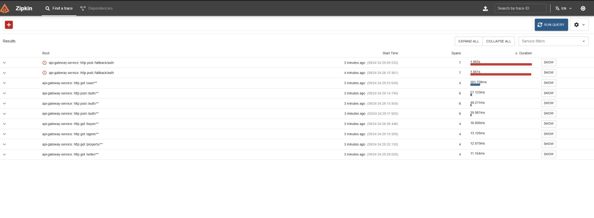
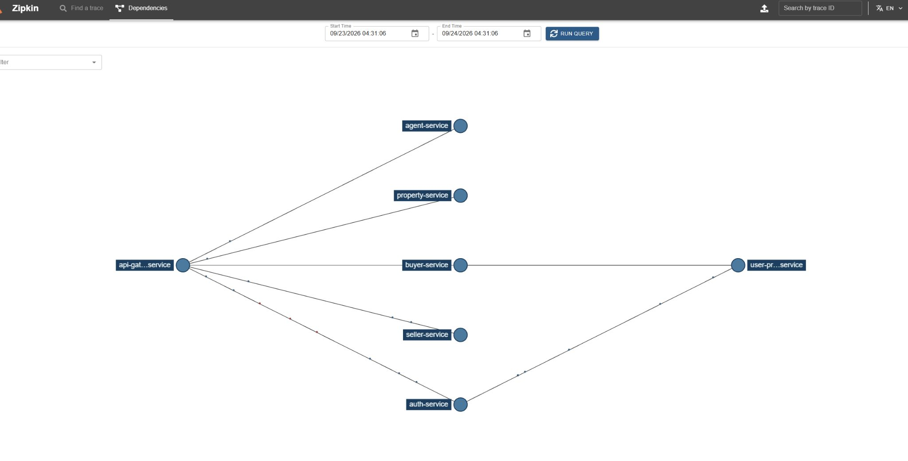
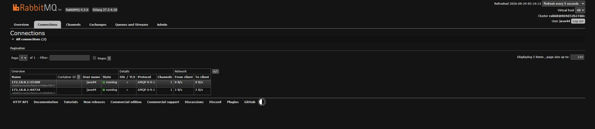
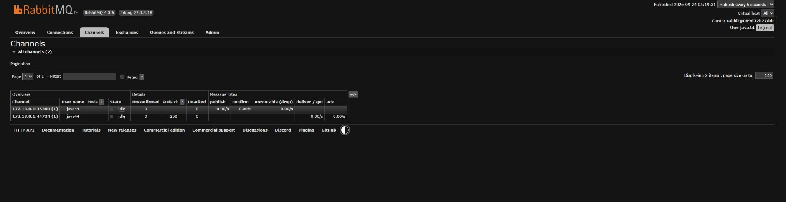
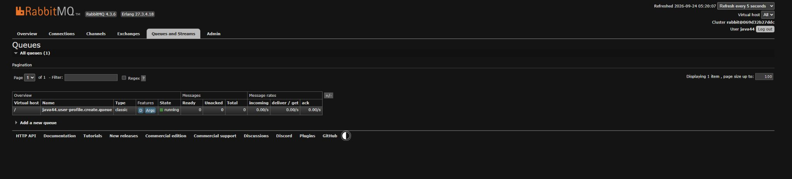
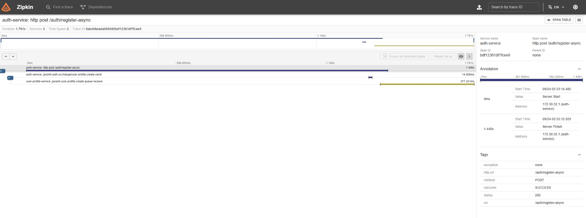
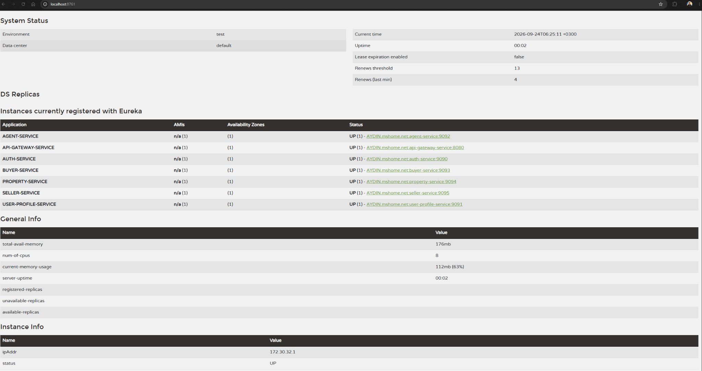

# java-44-microservice-project

Bu proje, referans eğitim projesindeki mikroservis mimarisini güncel Java ve Spring ekosistemiyle adım adım yeniden uygulamak için hazırlanmıştır.

## Day 1

İlk gün yalnızca mikroservis projesinin temeli ve **AuthService** oluşturulmuştur.

### Teknolojiler

- Java 21
- Spring Boot 4.1.1
- Gradle 9.7.1
- Spring Web MVC
- Spring Data JPA
- PostgreSQL
- Lombok
- MapStruct
- SpringDoc OpenAPI

### Day 1 yapısı

```text
java-44-microservice-project
├── AuthService
│   └── src/main/java/com/aydindemir
│       ├── controller
│       ├── model
│       ├── repository
│       └── service
├── build.gradle
├── dependencies.gradle
└── settings.gradle
```

AuthService varsayılan olarak **9090** portunda çalışır.

PostgreSQL bağlantısı environment variable ile değiştirilebilir:

- `AUTH_DB_URL`
- `AUTH_DB_USERNAME`
- `AUTH_DB_PASSWORD`

Day 2'de kayıt/giriş iş mantığı, DTO'lar, hata yönetimi ve JWT tabanlı authentication akışı geliştirilecektir.

## Day 2

İkinci gün AuthService'in kayıt, giriş, JWT ve merkezi hata yönetimi akışı geliştirilmiştir.

### Eklenen yapılar

- Endpoint sabitleri için `constant/EndPoint`
- Request DTO'ları: `DoRegisterRequestDto`, `DoLoginRequestDto`
- Register response DTO örnekleri
- Generic service altyapısı: `IService` ve `ServiceManager`
- `AuthServiceException`, `ErrorType`, `ErrorMessage`, `GlobalExceptionHandler`
- Auth0 `java-jwt` ile token üretme ve doğrulama
- Postman collection

### Day 2 Yapısı

```text
java-44-microservice-project
├── AuthService
│   ├── build.gradle
│   └── src
│       ├── main
│       │   ├── java/com/aydindemir
│       │   │   ├── AuthServiceApplication.java
│       │   │   ├── constant
│       │   │   │   └── EndPoint.java
│       │   │   ├── controller
│       │   │   │   ├── AuthController.java
│       │   │   │   └── HelloController.java
│       │   │   ├── dto
│       │   │   │   ├── request
│       │   │   │   │   ├── DoLoginRequestDto.java
│       │   │   │   │   └── DoRegisterRequestDto.java
│       │   │   │   └── response
│       │   │   │       ├── DoRegisterResponseDto.java
│       │   │   │       ├── DoRegisterResponseEmailDto.java
│       │   │   │       ├── DoRegisterResponseIdDto.java
│       │   │   │       ├── DoRegisterResponseIdUsernameEmailDto.java
│       │   │   │       ├── DoRegisterResponseUsernameDto.java
│       │   │   │       └── DoRegisterResponseUsernameEmailDto.java
│       │   │   ├── exception
│       │   │   │   ├── AuthServiceException.java
│       │   │   │   ├── ErrorMessage.java
│       │   │   │   ├── ErrorType.java
│       │   │   │   └── GlobalExceptionHandler.java
│       │   │   ├── model
│       │   │   │   ├── Auth.java
│       │   │   │   └── BaseEntity.java
│       │   │   ├── repository
│       │   │   │   └── IAuthRepository.java
│       │   │   ├── service
│       │   │   │   ├── AuthService.java
│       │   │   │   ├── IService.java
│       │   │   │   └── ServiceManager.java
│       │   │   └── utils
│       │   │       └── JwtTokenManager.java
│       │   └── resources
│       │       ├── application.properties
│       │       └── application.yml
│       └── test
├── Microservices-Project.postman_collection.json
├── docker-compose.yml
├── build.gradle
├── dependencies.gradle
├── settings.gradle
├── gradlew
└── gradlew.bat
```

### Day 2 endpointleri

- `POST /auth/register`
- `POST /auth/login`
- `GET /auth/findAll?token=...`
- `GET /auth/getMessage`

JWT ayarları environment variable ile değiştirilebilir:

- `AUTH_JWT_SECRET`
- `AUTH_JWT_ISSUER`
- `AUTH_JWT_EXPIRE_MS`

> Not: Referans eğitim akışına paralel olarak Day 2'de parola alanı doğrudan karşılaştırılmaktadır. Gerçek üretim sistemlerinde parola hash'leme ve Spring Security gibi güvenlik mekanizmaları kullanılmalıdır.

## Day 3

Üçüncü gün proje tek bir AuthService yapısından çoklu mikroservis yapısına genişletilmiştir. Referans Day 3 akışına paralel olarak **UserProfileService**, **AgentService**, **BuyerService**, **PropertyService** ve **SellerService** eklenmiştir.

### Day 3'te eklenenler

- Spring Cloud OpenFeign ile servisler arası senkron HTTP iletişimi
- `AuthService -> UserProfileService` kayıt akışı
- Auth tarafında `IUserProfileManager` Feign client
- Auth tarafında MapStruct tabanlı `IAuthMapper`
- `UserProfileService` için controller, DTO, entity, repository, service ve mapper katmanları
- UserProfileService için ayrı PostgreSQL veritabanı
- Agent, Buyer, Property ve Seller servisleri için temel Spring Boot mikroservis iskeletleri
- Servisler için ayrı portlar ve Postman istekleri

### Servisler ve portlar

| Servis | Port | Açıklama |
|---|---:|---|
| AuthService | 9090 | Kayıt, giriş ve JWT |
| UserProfileService | 9091 | Kullanıcı profil verisi |
| AgentService | 9092 | Day 3 temel servis iskeleti |
| BuyerService | 9093 | Day 3 temel servis iskeleti |
| PropertyService | 9094 | Day 3 temel servis iskeleti |
| SellerService | 9095 | Day 3 temel servis iskeleti |

### Auth -> UserProfile akışı

```text
POST /auth/register
       |
       v
   AuthService
       |
       |  Spring Cloud OpenFeign
       v
POST /user/save
       |
       v
UserProfileService
       |
       v
micro_user_profile_service_db
```

Auth kaydı oluşturulduktan sonra `authId`, `username` ve `email` bilgileri Feign üzerinden UserProfileService'e gönderilir.

UserProfileService adresi environment variable ile değiştirilebilir:

- `USER_PROFILE_SERVICE_URL`

UserProfile PostgreSQL bağlantısı:

- `USER_PROFILE_DB_URL`
- `USER_PROFILE_DB_USERNAME`
- `USER_PROFILE_DB_PASSWORD`

### Day 3 Yapısı

```text
java-44-microservice-project
├── AuthService
│   └── src/main/java/com/aydindemir
│       ├── dto/request
│       │   └── UserProfileSaveRequestDto.java
│       ├── manager
│       │   └── IUserProfileManager.java
│       └── mapper
│           └── IAuthMapper.java
├── UserProfileService
│   ├── build.gradle
│   └── src/main
│       ├── java/com/aydindemir
│       │   ├── UserProfileServiceApplication.java
│       │   ├── constant
│       │   ├── controller
│       │   ├── dto/request
│       │   ├── exception
│       │   ├── mapper
│       │   ├── model
│       │   ├── repository
│       │   └── service
│       └── resources/application.yml
├── AgentService
├── BuyerService
├── PropertyService
├── SellerService
├── Microservices-Project.postman_collection.json
├── docker-compose.yml
├── build.gradle
├── dependencies.gradle
└── settings.gradle
```

### Docker

Day 3 ile ikinci PostgreSQL container'ı eklenmiştir:

- Auth DB: `localhost:5433/micro_auth_service_db`
- UserProfile DB: `localhost:5434/micro_user_profile_service_db`

```bash
docker compose up -d
```

> Day 3 kapsamında Eureka, Config Server ve API Gateway eklenmemiştir. Bu bileşenler sonraki günlerin kapsamındadır.


## Day 4

Dördüncü gün merkezi konfigürasyon yönetimi için **Spring Cloud Config** eklenmiştir. Day 1-3 servisleri korunmuş, servislerin çalışma ayarları Config Server üzerinden merkezi olarak yönetilecek hale getirilmiştir.

### Eklenen modüller

- `ConfigServerLocal` — native/classpath tabanlı Config Server, port `8888`
- `ConfigServerRemote` — Git tabanlı Config Server, port `8889`

### Local Config Server

`ConfigServerLocal`, `native` profile ile kendi classpath'indeki `config-repo` klasöründen servis konfigürasyonlarını okur.

```text
ConfigServerLocal :8888
        |
        +-- auth-service.yml
        +-- auth-service-dev.yml
        +-- auth-service-test.yml
        +-- user-profile-service.yml
        +-- agent-service.yml
        +-- buyer-service.yml
        +-- property-service.yml
        +-- seller-service.yml
```

Örnek Config Server sorguları:

```text
http://localhost:8888/auth-service/default
http://localhost:8888/auth-service/dev
http://localhost:8888/user-profile-service/default
http://localhost:8888/agent-service/default
```

### Config Client

Altı iş servisi artık yalnızca kendi application adını ve Config Server adresini lokal `application.yml` dosyasında tutar:

```yaml
spring:
  application:
    name: auth-service
  config:
    import: "configserver:"
  cloud:
    config:
      uri: ${CONFIG_SERVER_URL:http://localhost:8888}
```

Port, datasource, JPA, Swagger, JWT ve servis URL ayarları merkezi config repository'ye taşınmıştır.

### Remote Config Server

`ConfigServerRemote`, Git backend kullanır ve servis konfigürasyonlarını ayrı bir **private** Git repository'den okur:

`aydindemir1/config-server-remote-microservice-project-2026`

Gerekli environment variable'lar:

- `REMOTE_CONFIG_PATH_PROJECT` — private config repository URI; varsayılan olarak yukarıdaki repository kullanılır
- `REMOTE_USERNAME` — GitHub kullanıcı adı
- `REMOTE_TOKEN_PASSWORD` — private repository için GitHub token/PAT

Token veya parola kaynak koda yazılmaz.

Remote Config Server portu `8889` olarak ayrılmıştır. Bir client'ı remote server ile çalıştırmak için:

```text
CONFIG_SERVER_URL=http://localhost:8889
```

kullanılabilir.

### Day 4 mimarisi

```text
                     ConfigServerLocal :8888
                       native backend
                             |
        +---------+----------+----------+---------+----------+
        |         |          |          |         |          |
       Auth   UserProfile   Agent      Buyer   Property    Seller
      :9090     :9091      :9092      :9093     :9094     :9095

                     ConfigServerRemote :8889
                         Git backend
                              |
                              v
        private config-server-remote-microservice-project-2026
```

> Day 4 kapsamında Eureka, API Gateway ve load balancing henüz eklenmemiştir.


## Day 5A

Beşinci günün ilk bölümünde mevcut Day 1-4 yapıları değiştirilmeden **API Gateway, routing, Circuit Breaker, fallback ve Actuator** eklendi.

### Eklenen teknoloji ve pattern'ler

- Spring Cloud Gateway Server Web MVC
- API Gateway Pattern
- Route / Predicate / Filter yapısı
- Spring Cloud Circuit Breaker
- Resilience4j
- Fallback Pattern
- Spring Boot Actuator
- Merkezi Gateway config yönetimi

### ApiGatewayService

Gateway varsayılan olarak `8080` portunda çalışır ve config'ini Day 4'te oluşturulan ConfigServerRemote üzerinden alır:

```text
Client
  |
  v
ApiGatewayService :8080
  |
  +--> /auth/**     -> AuthService :9090
  +--> /user/**     -> UserProfileService :9091
  +--> /agent/**    -> AgentService :9092
  +--> /buyer/**    -> BuyerService :9093
  +--> /property/** -> PropertyService :9094
  +--> /seller/**   -> SellerService :9095
```

Her route bir Circuit Breaker ile sarılmıştır. Hedef servis erişilemez olduğunda Gateway kendi `/fallback/**` endpoint'ine forward eder.

Gateway'in merkezi konfigürasyonu hem Local Config Server repository'sinde hem de ayrı private Remote Config repository'sinde `api-gateway-service.yml` olarak tutulur.

### Day 5A test örnekleri

```text
GET http://localhost:8080/auth/getMessage
GET http://localhost:8080/user/hello
GET http://localhost:8080/agent/hello
GET http://localhost:8080/buyer/hello
GET http://localhost:8080/property/hello
GET http://localhost:8080/seller/hello
GET http://localhost:8080/actuator/health
```

Circuit Breaker / fallback testi için hedef servislerden biri kapatılıp ilgili Gateway route'u tekrar çağrılır.

## Day 5B

Beşinci günün ikinci bölümünde mevcut Day 1-5A yapıları korunarak **distributed tracing** eklendi. Referans eğitim projesindeki eski Sleuth tabanlı yaklaşım birebir kopyalanmadı; Spring Boot 4.1.1 ile uyumlu modern tracing altyapısı kullanıldı.

### Eklenen teknoloji ve konular

- Micrometer Tracing
- OpenZipkin Brave
- Zipkin
- Spring Boot Actuator tracing altyapısı
- HTTP trace context propagation
- Spring Cloud OpenFeign çağrılarında trace propagation
- Merkezi tracing configuration
- Docker ile Zipkin çalıştırma
- Zipkin UI üzerinden distributed trace inceleme

### Tracing mimarisi

```text
Postman / Client
       |
       v
ApiGatewayService :8080
       |
       v
AuthService :9090
       |
       | Spring Cloud OpenFeign
       v
UserProfileService :9091
       |
       +--------------------+
                            |
                            v
                       Zipkin :9411
```

Gateway ve iş servisleri aynı distributed trace içinde izlenebilir. `POST /auth/register` akışı hem **Remote Config Server (`:8889`)** hem de **Local Config Server (`:8888`)** ile test edilmiştir. Gateway -> AuthService -> OpenFeign -> UserProfileService zincirinin tek trace altında oluştuğu Zipkin UI ve Zipkin API üzerinden doğrulanmıştır.

### Dependency yaklaşımı

Spring Cloud Sleuth kullanılmamıştır. Tracing için Spring Boot 4.1.1 ile uyumlu Zipkin starter'ı kullanılmıştır:

```gradle
implementation "org.springframework.boot:spring-boot-starter-zipkin"
```

AuthService'teki OpenFeign çağrılarının observation/tracing entegrasyonu için ayrıca:

```gradle
implementation "io.github.openfeign:feign-micrometer"
```

eklenmiştir.

Tracing desteği şu uygulama servislerinde etkinleştirilmiştir:

```text
ApiGatewayService
AuthService
UserProfileService
AgentService
BuyerService
PropertyService
SellerService
```

Config Server modülleri bu aşamada tracing kapsamına alınmamıştır.

### Merkezi tracing configuration

Local Config Server içinde ortak `application.yml` oluşturulmuştur. Aynı ortak configuration Remote Config repository'sinde de tutulur.

```yaml
management:
  tracing:
    sampling:
      probability: 1.0
    export:
      zipkin:
        endpoint: http://localhost:9411/api/v2/spans
```

Eğitim ve lokal test ortamında tüm isteklerin trace edilmesini kolaylaştırmak için sampling değeri `1.0` olarak ayarlanmıştır.

### Zipkin Docker

Proje köküne `docker-compose-zipkin.yml` eklenmiştir.

Zipkin'i başlatmak için:

```bash
docker compose -f docker-compose-zipkin.yml up -d
```

Zipkin UI:

```text
http://localhost:9411
```

### Day 5B test senaryosu

Temel distributed tracing testi:

```text
POST http://localhost:8080/auth/register
        |
        v
ApiGatewayService
        |
        v
AuthService
        |
        | OpenFeign
        v
UserProfileService
```

Başarılı testlerde Zipkin UI üzerinde aynı trace içinde Gateway, AuthService ve UserProfileService span'leri görülmüştür. Gateway server/client span'leri, Circuit Breaker span'i, AuthService server span'i, OpenFeign client span'i ve UserProfileService server span'i aynı `traceId` altında doğrulanmıştır.

Ayrıca aşağıdaki Gateway çağrılarıyla bağımsız servis trace'leri doğrulanabilir:

```text
GET http://localhost:8080/agent/hello
GET http://localhost:8080/buyer/hello
GET http://localhost:8080/property/hello
GET http://localhost:8080/seller/hello
```

### Day 5B doğrulama sonucu

- Remote Config Server ile tracing config merge edildi ve servislerde çalıştı.
- Local Config Server ile aynı tracing config doğrulandı.
- Gateway route istekleri Zipkin'e ulaştı.
- `POST /auth/register` zinciri `ApiGatewayService -> AuthService -> UserProfileService` olarak tek distributed trace içinde görüldü.
- OpenFeign çağrısında trace context propagation doğrulandı.
- Zipkin `Dependencies` görünümünde servis ilişkileri oluştu.
- Circuit Breaker ve fallback akışları trace içinde görünür hale geldi.
- POST isteklerinde fallback handler method uyumsuzluğu giderildi; fallback endpoint'leri HTTP method bağımsız çalışacak şekilde düzenlendi.

### Ekran görüntüleri

Zipkin üzerinde yakın zamanlı trace'ler:



Zipkin Dependencies görünümü:



**Day 5B tamamlandı ve hem Local hem Remote Config Server ile test edildi.**

Day 5B yalnızca tracing kapsamındadır; Prometheus, Grafana, Loki, Tempo ve daha geniş observability stack'i sonraki ileri seviye çalışmalar için ayrılmıştır.


## Day 6A

Altıncı günün ilk bölümünde mevcut senkron OpenFeign akışı korunarak **RabbitMQ + Spring AMQP** ile ayrı bir asenkron servisler arası iletişim senaryosu eklendi.

### Eklenen teknoloji ve konular

- RabbitMQ 4.3.6 Management
- Spring AMQP
- Spring Boot AMQP starter
- Direct Exchange
- Queue
- Routing Key
- `RabbitTemplate`
- `@RabbitListener`
- JSON message conversion
- Asenkron producer / consumer iletişimi
- RabbitMQ Management UI
- Micrometer Observation ile RabbitMQ tracing
- Zipkin üzerinde producer / consumer trace propagation

### Mevcut senkron akış korunur

Day 3'te oluşturulan OpenFeign tabanlı kayıt akışı değiştirilmemiştir:

```text
POST /auth/register
        |
        v
AuthService
        |
        | Spring Cloud OpenFeign
        v
UserProfileService
```

### Yeni asenkron kayıt akışı

RabbitMQ öğrenme amacıyla ayrı bir endpoint eklenmiştir:

```text
POST /auth/register-async
        |
        v
AuthService
        |
        | RabbitTemplate
        v
java44.auth.exchange
        |
        | routing key: user-profile.create
        v
java44.user-profile.create.queue
        |
        | @RabbitListener
        v
UserProfileService
        |
        v
PostgreSQL
```

Async endpoint başarılı publish sonrası `202 Accepted` döner.

### RabbitMQ Docker

RabbitMQ, Docker Compose ile çalıştırılır:

```bash
docker compose up -d rabbitmq
```

Portlar:

```text
AMQP       : 5672
Management : 15672
```

Management UI:

```text
http://localhost:15672
```

Lokal eğitim ortamındaki varsayılan kullanıcı:

```text
java44 / java44
```

### Messaging topology

```text
Exchange    java44.auth.exchange
Queue       java44.user-profile.create.queue
Routing Key user-profile.create
```

Exchange ve queue durable olarak tanımlanmıştır.

### Merkezi RabbitMQ configuration

RabbitMQ bağlantı bilgileri hem Local Config Server hem de Remote Config repository üzerinden yönetilir:

```yaml
spring:
  rabbitmq:
    host: ${RABBITMQ_HOST:localhost}
    port: ${RABBITMQ_PORT:5672}
    username: ${RABBITMQ_USERNAME:java44}
    password: ${RABBITMQ_PASSWORD:java44}
    template:
      observation-enabled: true
    listener:
      simple:
        observation-enabled: true
```

### RabbitMQ distributed tracing

RabbitMQ producer ve consumer observation desteği etkinleştirilmiştir. `POST /auth/register-async` testi Zipkin üzerinde aynı trace içerisinde doğrulanmıştır:

```text
auth-service: http post /auth/register-async
        |
        v
auth-service: java44.auth.exchange/user-profile.create send
        |
        v
user-profile-service: java44.user-profile.create.queue receive
```

Bu test ile HTTP request'ten başlayan trace context'in RabbitMQ message header'ları üzerinden producer'dan consumer'a taşındığı doğrulanmıştır.

### Day 6A doğrulama sonucu

- RabbitMQ container çalışıyor ve health check başarılı.
- RabbitMQ Management UI erişilebilir.
- AuthService ve UserProfileService AMQP bağlantıları başarılı.
- Exchange, queue ve routing key oluşturuldu.
- `POST /auth/register-async` başarılı çalıştı.
- Auth veritabanında kullanıcı kaydı oluştu.
- UserProfile veritabanında consumer tarafından profil kaydı oluşturuldu.
- Mesaj consumer tarafından tüketilip acknowledge edildi.
- RabbitMQ producer span'i Zipkin'de görüldü.
- RabbitMQ consumer span'i Zipkin'de görüldü.
- HTTP -> RabbitMQ producer -> RabbitMQ consumer zinciri aynı trace altında doğrulandı.

### Ekran görüntüleri

RabbitMQ bağlantıları:



RabbitMQ channel görünümü:



RabbitMQ queue görünümü:



Zipkin üzerinde RabbitMQ producer/consumer trace'i:



**Day 6A — RabbitMQ + Spring AMQP tamamlandı ve test edildi.**

Day 6'nın sonraki adımlarında **Spring Cloud Netflix Eureka** ve ardından **Spring Cloud LoadBalancer** ile service discovery + load balancing uygulanacaktır.


## Day 6B

Altıncı günün ikinci bölümünde **Spring Cloud Netflix Eureka** ile service registry ve service discovery altyapısı eklendi.

### Eklenen teknoloji ve konular

- Spring Cloud Netflix Eureka Server
- Spring Cloud Netflix Eureka Client
- Service Registry
- Service Registration
- Service Discovery altyapısı
- Eureka Dashboard
- Heartbeat / Lease Renewal
- Merkezi Eureka configuration

### Eureka Server

Yeni bir `EurekaServer` modülü eklendi ve varsayılan olarak `8761` portunda çalışacak şekilde yapılandırıldı.

```java
@EnableEurekaServer
@SpringBootApplication
public class EurekaServerApplication {

    public static void main(String[] args) {
        SpringApplication.run(EurekaServerApplication.class, args);
    }
}
```

Eureka Server kendi config'ini mevcut Spring Cloud Config altyapısından alır.

```text
EurekaServer :8761
        |
        +--> ConfigServerLocal  :8888
        |
        +--> ConfigServerRemote :8889
```

Server kendi Eureka registry'sine client olarak kayıt olmaz ve registry fetch etmez:

```yaml
eureka:
  client:
    registerWithEureka: false
    fetchRegistry: false
```

### Eureka Client servisleri

Aşağıdaki servisler Eureka Client olarak registry'ye kaydolur:

```text
ApiGatewayService
AuthService
UserProfileService
AgentService
BuyerService
PropertyService
SellerService
```

Ortak Eureka client ayarı Local ve Remote Config üzerinden merkezi yönetilir:

```yaml
eureka:
  client:
    serviceUrl:
      defaultZone: ${EUREKA_SERVER_URL:http://localhost:8761/eureka/}
```

Servis kimlikleri mevcut `spring.application.name` değerlerinden gelir.

### Doğrulanan registry

Eureka Dashboard üzerinde aşağıdaki servislerin tamamı `UP (1)` olarak doğrulandı:

```text
AGENT-SERVICE
API-GATEWAY-SERVICE
AUTH-SERVICE
BUYER-SERVICE
PROPERTY-SERVICE
SELLER-SERVICE
USER-PROFILE-SERVICE
```

Bu test ile servislerin Eureka Server'a register olduğu ve registry heartbeat / lease renewal mekanizmasının çalıştığı doğrulanmıştır.

### Day 6B sınırı

Bu aşamada mevcut Gateway route'ları ve OpenFeign client henüz service-name tabanlı hale getirilmemiştir. Mevcut sabit URL yaklaşımı korunmuştur:

```text
Gateway -> http://localhost:909x
Feign   -> configured service URL
```

Bu değişiklik bir sonraki adım olan **Day 6C — Spring Cloud LoadBalancer** kapsamında yapılacaktır.

### Day 6B doğrulama sonucu

- Eureka Server başarıyla ayağa kalktı.
- Eureka Dashboard `http://localhost:8761` üzerinden erişilebilir.
- Yedi uygulama servisi Eureka Client olarak register oldu.
- Tüm servisler dashboard üzerinde `UP (1)` durumda görüldü.
- Service Registry çalışıyor.
- Service Registration doğrulandı.
- Heartbeat / Lease Renewal çalışıyor.
- Local ve Remote Config ile Eureka ayarları merkezi yönetiliyor.
- Mevcut OpenFeign, Gateway, RabbitMQ ve tracing akışları korunmuştur.

### Ekran görüntüsü

Eureka Dashboard üzerinde kayıtlı servisler:



**Day 6B — Spring Cloud Netflix Eureka tamamlandı ve test edildi.**

Sonraki adım: **Day 6C — Spring Cloud LoadBalancer ile Gateway ve OpenFeign çağrılarını service-name tabanlı hale getirmek.**
